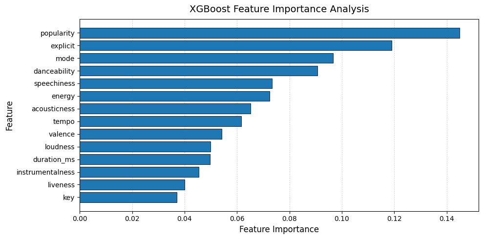
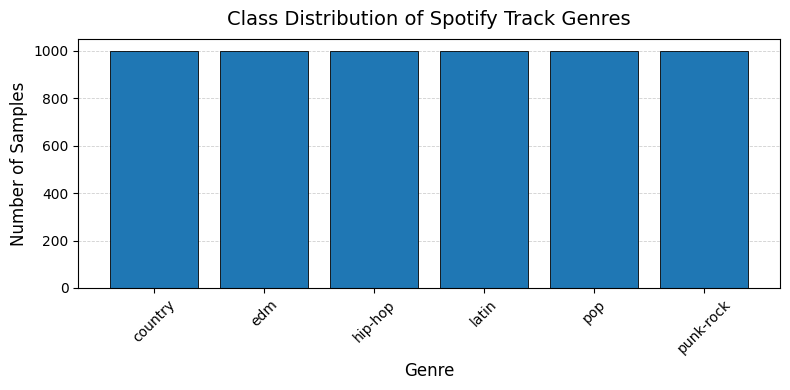
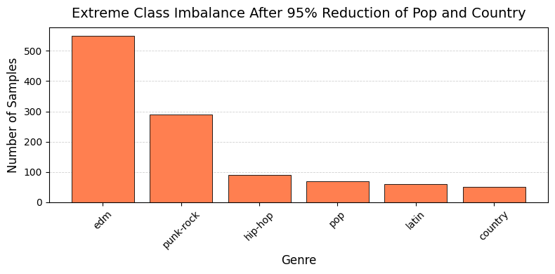
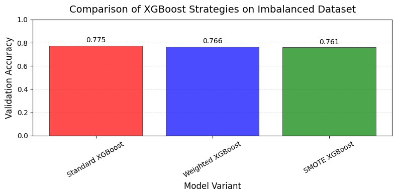

# 🎵 Spotify Tracks Dataset — XGBoost Experiments

This repository uses the **Spotify Tracks Dataset** from Kaggle, which contains a large collection of Spotify songs spanning **125 different genres**, along with their associated **audio features**.

🔗 Dataset source:  
[Spotify Tracks Dataset on Kaggle](https://www.kaggle.com/datasets/maharshipandya/-spotify-tracks-dataset)

---

## 📊 Dataset Overview

Each row in the dataset corresponds to a single Spotify track and includes:
- Track metadata (e.g. artist, track name)
- Audio features extracted by Spotify (e.g. danceability, energy, tempo, loudness)
- A genre label for each track

The dataset is provided in **CSV format**, making it easy and efficient to load and process using standard Python data science tools such as `pandas`.

---

## 🎯 Intended Use in This Repository

In this repository, the dataset is used for **supervised machine learning experiments with XGBoost**, focusing on:

- **Genre classification** based on audio features  
- Exploring feature importance and model interpretability  
- Benchmarking gradient-boosted decision trees on structured audio data  

Because the data is fully **tabular**, it is particularly well-suited for tree-based models such as **XGBoost**, without requiring feature engineering typical of raw audio processing.

---

## 📥 Setup Instructions

1. Download the dataset from Kaggle using the link above.
2. Extract the CSV file.
3. Place the CSV file in the **same directory as this notebook**.

Once the file is available locally, the notebook will load it directly and proceed with preprocessing and model training.

---

This setup provides a clean and reproducible starting point for experimenting with **XGBoost on music-related tabular data**.

### 📊 Feature Importance Analysis

Extracts feature importance scores from the trained XGBoost model and visualizes them in descending order. This plot highlights which audio features contribute most to the genre classification task, offering insight into the model’s decision-making process.

  

### ⚖️ Class Distribution and Imbalance Analysis

Computes and displays the distribution and relative proportions of genre labels in the dataset, followed by a bar chart visualization for intuitive inspection. An imbalance ratio is then calculated to quantify class imbalance, with a brief diagnostic message indicating whether mitigation strategies such as class weighting or resampling may be necessary. We construct a deliberately imbalanced version of the dataset by heavily downsampling selected genres while retaining different proportions of others. This setup is used to simulate real-world class imbalance scenarios, enabling analysis of model robustness and the impact of imbalance on classification performance.

  
  

## 📊 Comparing Imbalance Handling Strategies

Aggregates validation accuracy results from three different approaches—standard XGBoost, sample-weighted XGBoost, and SMOTE-based XGBoost—into a single table and bar chart for direct comparison. This visualization highlights how different imbalance mitigation strategies affect model performance and supports qualitative analysis of trade-offs, particularly in terms of minority class behavior.

  

